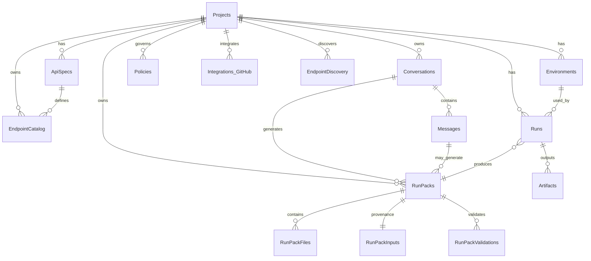

# Chapi.app — Database Schema (MVP + Extensions)

This document is the canonical reference for the Chapi.app database. It covers **core entities**, **extended RunPack module**, **relationships**, **indexes**, and **PostgreSQL DDL** starter scripts. It’s organized for a modular, DDD-friendly backend (ABP-style modules), but stays database-focused.

---

## Overview

**Core flow:** Projects import API specs → EndpointCatalog is built → a user asks for tests → LLM generates a Card and a RunPack (files) → a Run executes in a chosen Environment → Artifacts/Results are stored.

**Key modules:**

- **Projects** (tenancy boundary)  
- **Environments** (BASE_URL + secrets)  
- **ApiSpecs** (OpenAPI documents)  
- **EndpointCatalog** (normalized endpoints)  
- **RunPack** (generated files & inputs)  
- **Runs** (execution lifecycle) & **Artifacts** (produced files per run)  
- **Integrations** (GitHub) — optional  
- **Policies** — optional governance  
- **EndpointDiscovery** — optional, from code scan

> Use UUIDs (v4) for PKs; timestamps are UTC (`timestamptz`).

---

## Entities & Fields

### 1) Projects

| Field       | Type        | Notes                     |
| ----------- | ----------- | ------------------------- |
| id          | uuid PK     |                           |
| name        | text        | human-friendly name       |
| description | text?       | optional                  |
| created_at  | timestamptz | default now()             |
| updated_at  | timestamptz | maintained by app/trigger |

**Purpose:** Root container for everything else.

---

### 2) Environments

| Field      | Type                   | Notes                                                       |
| ---------- | ---------------------- | ----------------------------------------------------------- |
| id         | uuid PK                |                                                             |
| project_id | uuid FK → projects(id) | cascade delete optional                                     |
| name       | text                   | e.g., local, staging, prod                                  |
| base_url   | text                   | like `http://localhost:5066`                                |
| secrets    | jsonb                  | masked in UI (e.g., `{ "TOKEN": "...", "API_KEY": "..." }`) |
| created_at | timestamptz            |                                                             |
| updated_at | timestamptz            |                                                             |

**Purpose:** Connection & secret store for a project.

---

### 3) ApiSpecs

| Field      | Type                   | Notes                        |
| ---------- | ---------------------- | ---------------------------- |
| id         | uuid PK                |                              |
| project_id | uuid FK → projects(id) |                              |
| version    | text                   | e.g., v1                     |
| raw_json   | jsonb                  | full OpenAPI document        |
| source_url | text?                  | swagger.json URL if imported |
| created_at | timestamptz            |                              |

**Purpose:** Spec storage with versioning.

---

### 4) EndpointCatalog

| Field           | Type                    | Notes                                                         |
| --------------- | ----------------------- | ------------------------------------------------------------- |
| id              | uuid PK                 |                                                               |
| project_id      | uuid FK → projects(id)  |                                                               |
| spec_id         | uuid FK → api_specs(id) |                                                               |
| method          | text                    | GET/POST/PUT/PATCH/DELETE                                     |
| path            | text                    | `/api/users/{id}`                                             |
| summary         | text                    | short operation summary                                       |
| auth            | text                    | `bearer`, `apikey`, `basic`, `oauth2`, `none`, or mapped name |
| req_content     | text                    | request content type or `-`                                   |
| success_content | text                    | `200:application/json` etc.                                   |
| created_at      | timestamptz             |                                                               |

**Purpose:** Normalized endpoints for search and LLM context.

---

### 5) EndpointDiscovery (optional)

| Field           | Type                   | Notes                                   |
| --------------- | ---------------------- | --------------------------------------- |
| id              | uuid PK                |                                         |
| project_id      | uuid FK → projects(id) |                                         |
| code_snippet    | text                   | extracted code                          |
| detected_path   | text                   |                                         |
| detected_method | text                   |                                         |
| status          | text                   | `candidate` \| `accepted` \| `rejected` |
| created_at      | timestamptz            |                                         |

**Purpose:** Ingest endpoints from source code for review.

---

### 6) Conversations

| Field      | Type                   | Notes                                    |
| ---------- | ---------------------- | ---------------------------------------- |
| id         | uuid PK                |                                          |
| project_id | uuid FK → projects(id) | owner project                            |
| title      | text                   | conversation title (auto-generated/user) |
| created_at | timestamptz            |                                          |
| updated_at | timestamptz            |                                          |

**Purpose:** Chat conversation containers for organizing user interactions.

---

### 7) Messages

| Field           | Type                        | Notes                                        |
| --------------- | --------------------------- | -------------------------------------------- |
| id              | uuid PK                     |                                              |
| conversation_id | uuid FK → conversations(id) | parent conversation                          |
| role            | text                        | `user` \| `assistant`                        |
| content         | text                        | message text content                         |
| card_type       | text                        | `none` \| `plan` \| `diff` \| `run`          |
| card_payload    | jsonb?                      | structured card data (plans, diffs, results) |
| created_at      | timestamptz                 |                                              |

**Purpose:** Individual chat messages with optional structured card data.

---

### 8) RunPacks

| Field             | Type                        | Notes                                |
| ----------------- | --------------------------- | ------------------------------------ |
| id                | uuid PK                     |                                      |
| project_id        | uuid FK → projects(id)      | owner                                |
| conversation_id   | uuid FK → conversations(id) | optional chat context linkage        |
| message_id        | uuid FK → messages(id)?     | optional specific message linkage    |
| run_id            | uuid FK → runs(id)?         | optional execution linkage           |
| mode              | text                        | `bash-curl` \| `json-ir` \| `hybrid` |
| files_count       | integer                     | number of files added                |
| zip_url           | text?                       | storage URL if persisted             |
| status            | text                        | `draft` \| `finalized` \| `expired`  |
| generator_version | text                        | prompt/tooling version               |
| card_hash         | text                        | hash of card manifest                |
| inputs_hash       | text                        | hash of inputs (contexts/env)        |
| created_at        | timestamptz                 |                                      |
| finalized_at      | timestamptz?                |                                      |

**Purpose:** Cacheable bundle of generated test files with chat context.

---

### 9) RunPackFiles

| Field      | Type                    | Notes                         |
| ---------- | ----------------------- | ----------------------------- |
| id         | uuid PK                 |                               |
| runpack_id | uuid FK → run_packs(id) |                               |
| path       | text                    | `tests/email-service/auth.sh` |
| content    | text                    | full file body                |
| size_bytes | integer                 | convenience                   |
| role       | text                    | `AUTH` \| `SMOKE` \| `CRUD`   |
| created_at | timestamptz             |                               |

**Purpose:** Files included in a RunPack (pre-zip).

---

### 10) RunPackInputs

| Field                | Type                    | Notes                         |
| -------------------- | ----------------------- | ----------------------------- |
| id                   | uuid PK                 |                               |
| runpack_id           | uuid FK → run_packs(id) |                               |
| file_roles_json      | jsonb                   | map: path → role              |
| role_contexts_json   | jsonb                   | map: role → compact endpoints |
| endpoints_context    | text                    | compact endpoints string used |
| allowed_ops          | text                    | guardrail list                |
| env                  | text                    | local/staging/prod            |
| selector_output_json | jsonb?                  | LLM picks (if used)           |
| notes                | text?                   | extra hints                   |
| created_at           | timestamptz             |                               |

**Purpose:** Provenance for deterministic rebuilds.

---

### 11) RunPackValidations

| Field      | Type                    | Notes                                                                      |
| ---------- | ----------------------- | -------------------------------------------------------------------------- |
| id         | uuid PK                 |                                                                            |
| runpack_id | uuid FK → run_packs(id) |                                                                            |
| file_path  | text                    | target path                                                                |
| rule       | text                    | e.g., `NoRootUrl`, `AuthThreeCases`, `NoDangerousShell`, `JsonSchemaValid` |
| passed     | boolean                 |                                                                            |
| details    | jsonb?                  | failure info                                                               |
| created_at | timestamptz             |                                                                            |

**Purpose:** Guardrails before packaging/running.

---

### 12) Runs

| Field        | Type                       | Notes                                         |
| ------------ | -------------------------- | --------------------------------------------- |
| id           | uuid PK                    |                                               |
| project_id   | uuid FK → projects(id)     |                                               |
| env_id       | uuid FK → environments(id) |                                               |
| status       | text                       | `queued` \| `running` \| `passed` \| `failed` |
| user_query   | text                       | original chat instruction                     |
| card         | jsonb                      | LLM card (plan, files, actions)               |
| created_at   | timestamptz                |                                               |
| completed_at | timestamptz?               |                                               |

**Purpose:** Execution lifecycle record.

---

### 13) Artifacts

| Field      | Type               | Notes                            |
| ---------- | ------------------ | -------------------------------- |
| id         | uuid PK            |                                  |
| run_id     | uuid FK → runs(id) |                                  |
| path       | text               | file path                        |
| content    | text               | file body (if you store per run) |
| created_at | timestamptz        |                                  |

**Purpose:** Files produced/used by a run. If using RunPack as cache, you may copy from RunPackFiles into Artifacts at execution time.

---

### 14) Integrations_GitHub (optional)

| Field           | Type                   | Notes                   |
| --------------- | ---------------------- | ----------------------- |
| id              | uuid PK                |                         |
| project_id      | uuid FK → projects(id) |                         |
| installation_id | text                   | GitHub App installation |
| repo            | text                   | owner/repo              |
| created_at      | timestamptz            |                         |

**Purpose:** GitHub checks/PR integration.

---

### 15) Policies (optional)

| Field      | Type                   | Notes                                        |
| ---------- | ---------------------- | -------------------------------------------- |
| id         | uuid PK                |                                              |
| project_id | uuid FK → projects(id) |                                              |
| type       | text                   | e.g., `require-auth`, `validate-json-schema` |
| rules      | jsonb                  | policy JSON                                  |
| created_at | timestamptz            |                                              |

**Purpose:** Governance rules applied to packs/runs.

---

## Relationships (Mermaid ERD)



---

## Indexes & Constraints

- `projects(name)` unique (optional)
- `environments(project_id, name)` unique
- `api_specs(project_id, version)` unique (optional)
- `endpoint_catalog(project_id, path, method)` non-unique (supports multiple specs)
- `conversations(project_id, created_at)`
- `messages(conversation_id, created_at)`
- `runs(project_id, created_at)`
- `run_packs(project_id, inputs_hash)` (cache)
- `run_packs(conversation_id, created_at)` (chat context)
- `run_packs(message_id)` unique (message linkage)
- `run_pack_files(runpack_id, path)`
- `run_pack_validations(runpack_id, file_path)`
- `artifacts(run_id, path)`

**Foreign keys:** use `ON DELETE CASCADE` where safe (e.g., deleting a Project cascades to dependent rows) or restrict if you prefer explicit cleanup.

---

## PostgreSQL DDL (Starter)

> These are starter migrations; adjust for your naming conventions & schema.

```sql
CREATE EXTENSION IF NOT EXISTS "uuid-ossp";

CREATE TABLE projects (
  id uuid PRIMARY KEY DEFAULT uuid_generate_v4(),
  name text NOT NULL,
  description text,
  created_at timestamptz NOT NULL DEFAULT now(),
  updated_at timestamptz NOT NULL DEFAULT now()
);

CREATE TABLE environments (
  id uuid PRIMARY KEY DEFAULT uuid_generate_v4(),
  project_id uuid NOT NULL REFERENCES projects(id) ON DELETE CASCADE,
  name text NOT NULL,
  base_url text NOT NULL,
  secrets jsonb NOT NULL DEFAULT '{}'::jsonb,
  created_at timestamptz NOT NULL DEFAULT now(),
  updated_at timestamptz NOT NULL DEFAULT now(),
  UNIQUE (project_id, name)
);

CREATE TABLE api_specs (
  id uuid PRIMARY KEY DEFAULT uuid_generate_v4(),
  project_id uuid NOT NULL REFERENCES projects(id) ON DELETE CASCADE,
  version text NOT NULL,
  raw_json jsonb NOT NULL,
  source_url text,
  created_at timestamptz NOT NULL DEFAULT now()
);

CREATE TABLE endpoint_catalog (
  id uuid PRIMARY KEY DEFAULT uuid_generate_v4(),
  project_id uuid NOT NULL REFERENCES projects(id) ON DELETE CASCADE,
  spec_id uuid NOT NULL REFERENCES api_specs(id) ON DELETE CASCADE,
  method text NOT NULL,
  path text NOT NULL,
  summary text NOT NULL,
  auth text NOT NULL,
  req_content text NOT NULL,
  success_content text NOT NULL,
  created_at timestamptz NOT NULL DEFAULT now()
);
CREATE INDEX ix_endpoint_catalog_project_path_method ON endpoint_catalog(project_id, path, method);

CREATE TABLE conversations (
  id uuid PRIMARY KEY DEFAULT uuid_generate_v4(),
  project_id uuid NOT NULL REFERENCES projects(id) ON DELETE CASCADE,
  title text NOT NULL,
  created_at timestamptz NOT NULL DEFAULT now(),
  updated_at timestamptz NOT NULL DEFAULT now()
);
CREATE INDEX ix_conversations_project_created ON conversations(project_id, created_at DESC);

CREATE TABLE messages (
  id uuid PRIMARY KEY DEFAULT uuid_generate_v4(),
  conversation_id uuid NOT NULL REFERENCES conversations(id) ON DELETE CASCADE,
  role text NOT NULL,
  content text NOT NULL,
  card_type text NOT NULL DEFAULT 'none',
  card_payload jsonb,
  created_at timestamptz NOT NULL DEFAULT now()
);
CREATE INDEX ix_messages_conversation_created ON messages(conversation_id, created_at);

CREATE TABLE run_packs (
  id uuid PRIMARY KEY DEFAULT uuid_generate_v4(),
  project_id uuid NOT NULL REFERENCES projects(id) ON DELETE CASCADE,
  conversation_id uuid REFERENCES conversations(id) ON DELETE SET NULL,
  message_id uuid REFERENCES messages(id) ON DELETE SET NULL,
  run_id uuid REFERENCES runs(id) ON DELETE SET NULL,
  mode text NOT NULL,
  files_count integer NOT NULL DEFAULT 0,
  zip_url text,
  status text NOT NULL DEFAULT 'draft',
  generator_version text,
  card_hash text,
  inputs_hash text,
  created_at timestamptz NOT NULL DEFAULT now(),
  finalized_at timestamptz
);
CREATE INDEX ix_run_packs_project_created ON run_packs(project_id, created_at DESC);
CREATE INDEX ix_run_packs_conversation ON run_packs(conversation_id, created_at DESC);
CREATE UNIQUE INDEX ix_run_packs_message ON run_packs(message_id) WHERE message_id IS NOT NULL;

CREATE TABLE run_pack_files (
  id uuid PRIMARY KEY DEFAULT uuid_generate_v4(),
  runpack_id uuid NOT NULL REFERENCES run_packs(id) ON DELETE CASCADE,
  path text NOT NULL,
  content text NOT NULL,
  size_bytes integer NOT NULL DEFAULT 0,
  role text NOT NULL,
  created_at timestamptz NOT NULL DEFAULT now(),
  UNIQUE (runpack_id, path)
);

CREATE TABLE run_pack_inputs (
  id uuid PRIMARY KEY DEFAULT uuid_generate_v4(),
  runpack_id uuid NOT NULL UNIQUE REFERENCES run_packs(id) ON DELETE CASCADE,
  file_roles_json jsonb NOT NULL,
  role_contexts_json jsonb NOT NULL,
  endpoints_context text NOT NULL,
  allowed_ops text NOT NULL,
  env text NOT NULL,
  selector_output_json jsonb,
  notes text,
  created_at timestamptz NOT NULL DEFAULT now()
);

CREATE TABLE run_pack_validations (
  id uuid PRIMARY KEY DEFAULT uuid_generate_v4(),
  runpack_id uuid NOT NULL REFERENCES run_packs(id) ON DELETE CASCADE,
  file_path text NOT NULL,
  rule text NOT NULL,
  passed boolean NOT NULL,
  details jsonb,
  created_at timestamptz NOT NULL DEFAULT now()
);
CREATE INDEX ix_run_pack_validations_file ON run_pack_validations(runpack_id, file_path);

CREATE TABLE runs (
  id uuid PRIMARY KEY DEFAULT uuid_generate_v4(),
  project_id uuid NOT NULL REFERENCES projects(id) ON DELETE CASCADE,
  env_id uuid NOT NULL REFERENCES environments(id) ON DELETE RESTRICT,
  status text NOT NULL,
  user_query text NOT NULL,
  card jsonb NOT NULL,
  created_at timestamptz NOT NULL DEFAULT now(),
  completed_at timestamptz
);
CREATE INDEX ix_runs_project_created ON runs(project_id, created_at DESC);

CREATE TABLE artifacts (
  id uuid PRIMARY KEY DEFAULT uuid_generate_v4(),
  run_id uuid NOT NULL REFERENCES runs(id) ON DELETE CASCADE,
  path text NOT NULL,
  content text NOT NULL,
  created_at timestamptz NOT NULL DEFAULT now(),
  UNIQUE (run_id, path)
);

-- Optional modules
CREATE TABLE integrations_github (
  id uuid PRIMARY KEY DEFAULT uuid_generate_v4(),
  project_id uuid NOT NULL REFERENCES projects(id) ON DELETE CASCADE,
  installation_id text NOT NULL,
  repo text NOT NULL,
  created_at timestamptz NOT NULL DEFAULT now()
);

CREATE TABLE policies (
  id uuid PRIMARY KEY DEFAULT uuid_generate_v4(),
  project_id uuid NOT NULL REFERENCES projects(id) ON DELETE CASCADE,
  type text NOT NULL,
  rules jsonb NOT NULL,
  created_at timestamptz NOT NULL DEFAULT now()
);

CREATE TABLE endpoint_discovery (
  id uuid PRIMARY KEY DEFAULT uuid_generate_v4(),
  project_id uuid NOT NULL REFERENCES projects(id) ON DELETE CASCADE,
  code_snippet text NOT NULL,
  detected_path text NOT NULL,
  detected_method text NOT NULL,
  status text NOT NULL,
  created_at timestamptz NOT NULL DEFAULT now()
);
```

---

## ABP/DDD Hints (Entity → Module)

- **ProjectsModule**: Projects, Environments  
- **SpecsModule**: ApiSpecs, EndpointCatalog  
- **ChatModule**: Conversations, Messages
- **RunPacksModule**: RunPacks, RunPackFiles, RunPackInputs, RunPackValidations  
- **RunsModule**: Runs, Artifacts  
- **IntegrationsModule**: Integrations_GitHub  
- **GovernanceModule**: Policies  
- **DiscoveryModule** (optional): EndpointDiscovery

Keep each module with its own DbContext & migrations; aggregate roots: Project, Conversation, RunPack, Run.

---

## Data Retention

- **RunPacks**: retain latest `N` finalized packs per project; expire drafts after 7–14 days.  
- **Runs/Artifacts**: retain 30–90 days (configurable).  
- **ApiSpecs**: retain all versions, or GC old ones when unused.

---

## Security Notes

- Secrets in **Environments.secrets** should be **encrypted at rest** (KMS) and **masked** in logs.  
- Enforce row-level ownership by `project_id`.  
- Store only **normalized** OpenAPI data needed for LLM; keep originals in `ApiSpecs.raw_json`.

---

*End of document.*
